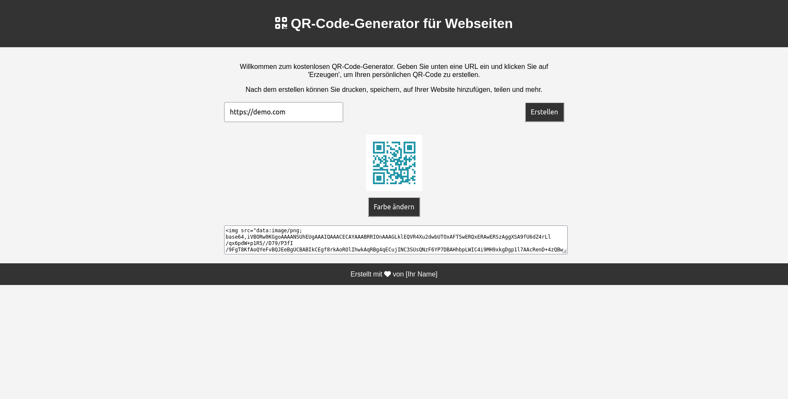

# QR-Code-Generator für Webseiten

## Übersicht

Dies ist ein kostenloser QR-Code-Generator, mit dem du QR-Codes für beliebige URLs erstellen kannst. Einfach URL eingeben, 'Generieren' klicken und schon hast du deinen QR-Code. Mit zusätzlichen Funktionen wie Farbänderung.

## Features

- QR-Code-Generierung mit einem Klick
- Individuelle Farbgestaltung für QR-Codes
- Responsive Design für Desktop und Mobilgeräte
- Eingebetteter ``-Tag im Textbereich für einfache Integration in Webseiten

## Anleitung

1. URL im Eingabefeld eingeben.
2. 'Generieren' klicken.
3. Optional: Farbe ändern durch Klick auf 'Farbe ändern'.
4. QR-Code verwenden oder ``-Tag kopieren und in deine Website einfügen.

## Installation

Keine Installation erforderlich. Einfach den Link zur Webseite besuchen: [Fancy QR Code Generator](#)

## Technologien

- HTML5
- CSS3
- JavaScript
- QRCode.js Library

## Autor

[Dein Name](https://github.com/deingithubnutzername)

## Lizenz

Dieses Projekt steht unter der MIT-Lizenz - siehe die [LICENSE.md](LICENSE.md) Datei für Details.

---

Für weitere Informationen, bitte das [Wiki](https://github.com/deingithubnutzername/Fancy-QR-Code-Generator/wiki) besuchen.
